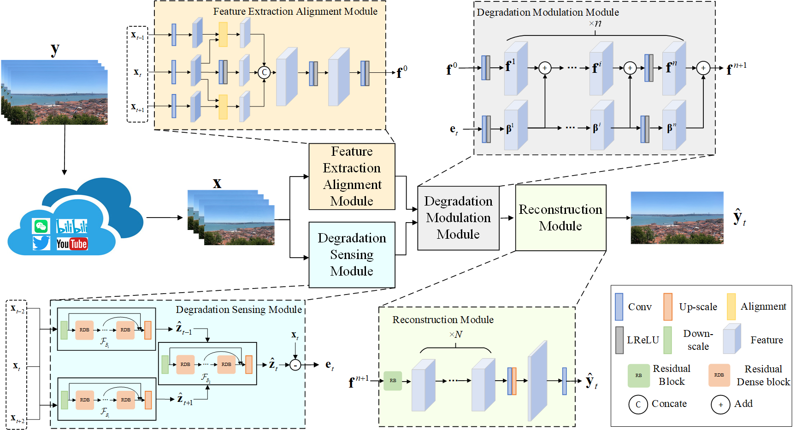

# Resotration of User Videos Shared on Social Media 

Hongming Luo, Fei Zhou, Kim man Lam, Guoping Qiu

This repository is the official PyTorch implementation of *Resotration of User Videos Shared on Social Media*
([arxiv](https://arxiv.org/abs/2208.08597)). This paper has been accepted by ACMMM 2022.


## Contents

0. [Introduction](#Introduction)
1. [Installation](#Installation)
2. [Train](#Train)
3. [Test](#Test)
4. [Results](#Results)
5. [Citation](#Citation)
6. [Acknowledgment](#Acknowledgment)
7. [License](#License)


<h2 id="Introduction"> Introduction </h2>

User videos shared on social media platforms usually suffer from
degradations caused by unknown proprietary processing procedures,
which means that their visual quality is poorer than that of
the originals. This paper presents a new general video restoration
framework for the restoration of user videos shared on social media
platforms. In contrast to most deep learning-based video restoration
methods that perform end-to-end mapping, where feature extraction
is mostly treated as a *black box*, in the sense that what role a
feature plays is often unknown, our new method, termed **V**ideo
rest**O**ration through adap**T**ive d**E**gradation **S**ensing (VOTES), introduces
the concept of a degradation feature map (DFM) to explicitly
guide the video restoration process. Specifically, for each video
frame, we first adaptively estimate its DFM to extract features representing
the difficulty of restoring its different regions. We then
feed the DFM to a convolutional neural network (CNN) to compute
hierarchical degradation features to modulate an end-to-end video
restoration backbone network, such that more attention is paid
explicitly to potentially more difficult to restore areas, which in
turn leads to enhanced restoration performance. We will explain
the design rationale of the VOTES framework and present extensive
experimental results to show that the new VOTES method outperforms
various state-of-the-art techniques both quantitatively and
qualitatively. In addition, we contribute a large scale real-world
database of user videos shared on different social media platforms.



<h2 id="Installation"> Installation </h2>

* Python 3.7
* PyTorch >= 1.8.0
* NVIDIA GPU + CUDA

1. Clone repo

    ```git clone https://github.com/luohongming/VOTES.git```

2. Install dependent packages

    ```
   cd VOTES
   pip install -r requirements.txt 
    ```

3. Please run the following commands in the VOTES root path

    ```
    python setup.py develop
    ```

<h2 id="Train"> Train </h2>

### 1. Dataset preparation

   You need to download the UVSSM dataset or REDS dataset.

   For UVSSM dataset, you can download it in [Baidu Netdisk](https://pan.baidu.com/s/1jHP2o-IhXGwh9zl_RKA0ZQ) (access code: rsqw)
   The dataset folder should be:
   ```
   --UVSSM
      --WeChat
         --HQ_frames
            --001
               --00000000.png
         --LQ_frames
            --001
      --twitter
      --bilibili
   ```
   The HQ_frames folder in the twitter, bilibili and Youtube folders are the same, therefore, you can download
   the HQ_frames folder in the twitter folder, then copy this folder to the bilibili and Youtube folders. But 
   the LQ_frames folder in these folders are different, you still need to download LQ_frames in these three folders.

   For REDS dataset, you can download it in [REDS](https://seungjunnah.github.io/Datasets/reds.html). We only used two subsets of REDS, i.e., train_sharp, val_sharp.
   
   We move the 30 folders of val_sharp to train_sharp by renaming the folder_num (from 000-029 to 240-269).
   And we need to compress and downscale these frames into videos using [FFmpeg](https://ffmpeg.org/).
   ```
   ffmpeg -f image2 -i $input_dir/$folder/%08d.png -vcodec libx264 -r 25 -qp 33 -y -s 640x360 -pix_fmt yuv420p $folder.mp4
   ```
   Then we extract the compressed videos to frames again.
   ```
   ffmpeg -i $folder -f image2 -start_number 0 $output_dir/${folder: 0:3}/%08d.png 
   ```
   The dataset folder should be:
   ```
   --REDS_compressed
      --HQ_frames
         --000
            --00000000.png
         --001
      --LQ_frames
   ```

### 2.Get pretrained models
   Our pretrained models can be downloaded via [Google Drive](https://drive.google.com/file/d/1tjD7xzzvPtjjVbmOHp9CRsSF4RY3EV8F/view?usp=sharing) 
   or [Baidu Netdisk](https://pan.baidu.com/s/18Sax5kCcAZsZpk7dfj1DLA) (access code: qb5v). After you download the pretrained models,
   please put them into the ```$ROOT/experiments``` folder.
   And the pretrained bin model (```bin_100000.pth```) is necessary for training VOTES.

### 3.Set up configuration
   Our training settings in the paper can be found at ```$ROOT/options/train/VOTES/xxx.yml```

### 4.Train the VOTES 
   You can train the VOTES using the following commands:

   (Modify the file train_sh.sh)

   ``` 
   bash train_sh.sh
   ```

   or (Using only one gpu)
   
   ```
   bash dist_train.sh 1 ./options/train/VOTES/train_VOTES_L_x2_SR_REDS_QP33.yml 4321
   bash dist_train.sh 1 ./options/train/VOTES/train_VOTES_L_x2_SR_UVSSMWeChat.yml 4321
   ```
   or (Using several gpus)
   ```
   bash dist_train.sh 2 ./options/train/VOTES/train_VOTES_L_x2_SR_REDS_QP33.yml 4321
   bash dist_train.sh 3 ./options/train/VOTES/train_VOTES_L_x2_SR_UVSSMWeChat.yml 4321
   ```

<h2 id="Test"> Test </h2>

   You can test the VOTES using the following commands:

   (Modify the file test_sh.sh)

   ``` 
   bash test_sh.sh
   ```

   or (Using only one gpu)
   
   ```
   bash dist_train.sh 1 ./options/train/VOTES/train_VOTES_L_x2_SR_REDS_QP33.yml 4321
   bash dist_train.sh 1 ./options/train/VOTES/train_VOTES_L_x2_SR_UVSSMWeChat.yml 4321
   ```
   or (Using several gpus)
   ```
   bash dist_train.sh 2 ./options/train/VOTES/train_VOTES_L_x2_SR_REDS_QP33.yml 4321
   bash dist_train.sh 3 ./options/train/VOTES/train_VOTES_L_x2_SR_UVSSMWeChat.yml 4321
   ```

<h2 id="Results"> Results </h2>

We achieve the best performance comparing other SOTA methods.

The visual comparisons on the UVSSM dataset. The upscale factor is x2.


The visual comparisons on the REDS dataset. The upscale factor is x2 and the QP is 28.


The visual comparisons on the REDS dataset. The upscale factor is x4 and the QP is 33.


More results can be found in the supplementary materials. 


<h2 id="Citation"> Citation </h2>

```
@InProceedings{Luo2022VOTES,
  author    = {Hongming Luo, Fei Zhou, Kin-man Lam and Guoping Qiu},
  title     = {Resotration of User Videos Shared on Social Media},
  booktitle = {ACMMM},
  year      = {2022},
}
```

<h2 id="Acknowledgment"> Acknowledgment </h2>

   Our code is built on [EDVR](https://github.com/xinntao/EDVR). We thank the authors for sharing their codes.

<h2 id="License"> License </h2> 

   The code and UVSSM dataset are released under the Creative Commons Attribution-NonCommercial-ShareAlike 4.0 International
   Public License for NonCommercial use only. Any commercial use should get formal permission first. 